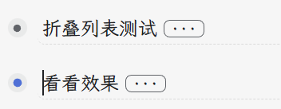

The plug-in adds a preview function to the collapsed list.

Move the mouse to the”...” position, or click the icon to preview the contents of the collapsed list in the hover window.

The plug-in has a built-in collapsed list style that can be modified with code snippets, themes, and element selectors like this:

```css
.protyle-wysiwyg [data-node-id].li[fold="1"]>.p>[spellcheck]:not(.fn__flex-1.history__text.protyle  [data-node-id].li[fold="1"]>.p>[spellcheck])::after
```

Known effects of plug-ins on editors:

In this case:

A normal edit click jumps to the beginning of the previous list (“Collapse list test”) , and you need to click it twice after using the plug-in.

A normal edit click can jump to the end of the previous list, and you need to click twice to use the plug-in.



Reference has been removed theme [HBuilderX-Light](https://github.com/UFDXD/HBuilderX-Light) production